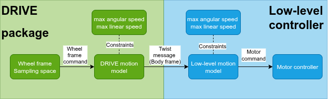

# Sampling Space Identification 
Before explaining how to identify the sampling space, it is essential to understand the pipeline that is executed by a command. 

## Command pipeline
A robot often use a low-level controller who's job is to receive twist message and transform it to a wheel target speed to each wheel motor controller. This means that if we want to sample wheel speed command, we will need to convert them to a twist message using a first motion model, send this twist message to the low-level controller so that it transfers it to a wheel command and send it to the corresponding motor. The folowing diagram summarize the pipeline that is required for DRIVE to sample a command and send it to the motor: 



This pipeline allow us to identify the condition to make sure that the command sampled by DRIVE in the wheel frame are equals the command sent to the motor controller: 

1. **The motion model used in DRIVE must be the same as the one used by the low-level controller.** For a skid-steer, the ideal differential drive (IDD) motion model should be used in both the low-level controller and the DRIVE package. 
2. **The parameter of the two motion models needs to be the same.** For example, the base width, base width gain, wheel radius and wheel raddius gain of the (IDD) motion model must be the same for both the motion model. 
3. **The parameters that represent physical parameters, it must be adjust to the measurements.** For example, one of the parameter of the IDD is the basewidth of the vehicle. This parameter is the distance between the center of the two wheels on the same axle. However, this parameter is often modify in the software to have a better representation of the slip that happens in rotation. For DRIVE the purpose of system identification it is important that the basewidth represent the measured basewidth. Thus, if a base_width_gain parameter exist, it must be fixed to 1.0.  

4. **The constraint applied on the low-level controller needs to be less or equally restrictive to the constraints of the DRIVE motion model.** For example, if the low-level controller has a maximum linear velocity and a maximum angular velocity, they must be higher or equal to the maximum linear velocity and maximum angular velocity define in the DRIVE package. Note that you might want to have more restrictive maximum angular velocity and maximum linear velocity in DRIVE depending on the surface you are deploying. 

If these conditions are not respected, the data collected by DRIVE will not be representative of the reality and it will not be an identification of the system. Artificial clipping of the command could happen. This artificial clipping will bias the uniform sampling to oversampled the border that are clipped.    

## Step to identifies the sampling space

The identificaiton of the sampling space is splitted in two major parts. 

The first parts consist of analysing and fixing the motion models parameter values.

1. Find the config file of the low-level controller on your robot. 
2. Identify the motion model and its parameters:
    * **Motion model used:** ex.  
    * **Parameters of the motion models**
    * **Maximum linear speed**
    * **Maximum angular speed**
3. For all the parameters that represent measurements on the robot (like wheel radi and basewidth). 
    * Measure the parameter. Follow the guide for each. 
    * Modify the parameter in the low level.
    * Set any gain_parameter to 1.0
    * Note the value 
4. Go in the config file of your robot on DRIVE and enter the corresponding parameters.  

5. Then execute the launch calibration node. 

## Calibration node 
The calibration node is a node that is used to combine your maximal linear speed, maximal angular speed parameters and your maximum wheel speed to identify the sampling space. This node will get accurate results only if the precedent step are correctly executed. The folowing diagram summarize the calibration node steps: 


Launch the calibration node by doing 
```bash 
ros2 launch  
```